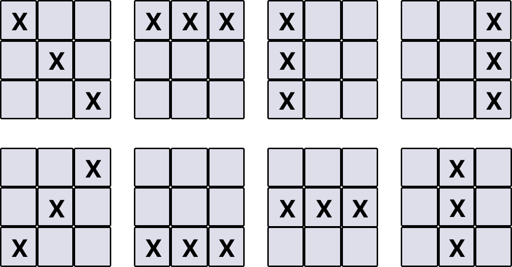

# Tic Tac Toe Game

A Tic-Tac-Toe game built using React.js, TypeScript, and Tailwind CSS.

## Features

- Interactive 3x3 game board
- Two-player gameplay (X and O)
- Real-time winner detection
- Draw game detection
- Game reset functionality
- Responsive design with Tailwind CSS
- Clean and modern UI

## Tech Stack

- **React.js**, **TypeScript**, and **Tailwind CSS** for the frontend
- **Vite** as the build tool

## Project Structure

```
src/
├── components/
│   ├── Board.tsx       # Main game board component
│   └── Square.tsx      # Individual square component
├── App.tsx             # Main application component
├── main.tsx           # Application entry point
└── index.css          # Global styles
```

## Installation

1. Clone the repository:
```bash
git clone <repository-url>
cd tic-tac-toe
```

2. Install dependencies:
```bash
npm install
```

3. Start the development server:
```bash
npm run dev
```

4. Open your browser and navigate to `http://localhost:5173`

## Available Scripts

- `npm run dev` - Start development server
- `npm run build` - Build for production
- `npm run preview` - Preview production build
- `npm run lint` - Run ESLint

## How to Play

1. Click "Start Game" to begin
2. Players take turns clicking on empty squares
3. Player X goes first, followed by Player O
4. The first player to get three of their marks in a row (horizontally, vertically, or diagonally) wins
5. If all squares are filled without a winner, the game ends in a draw
6. Click "Reset" to start a new game

## Game Winning Logic

The game implements these winning combinations:
- Horizontal: [1,2,3], [4,5,6], [7,8,9]
- Vertical: [1,4,7], [2,5,8], [3,6,9]
- Diagonal: [1,5,9], [3,5,7]

## winning combinations image


## Components

### App.tsx
Main application component that manages the game state and renders the start screen or game board.

### Board.tsx
Core game component that handles:
- Game state management
- Player turns
- Winner detection
- Draw detection
- Square click handling

### Square.tsx
Individual square component that represents each cell in the 3x3 grid.

## Contributing

1. Fork the repository
2. Create a feature branch
3. Make your changes
4. Run tests and linting
5. Submit a pull request

## License

This project is open source and available under the [MIT License](LICENSE).